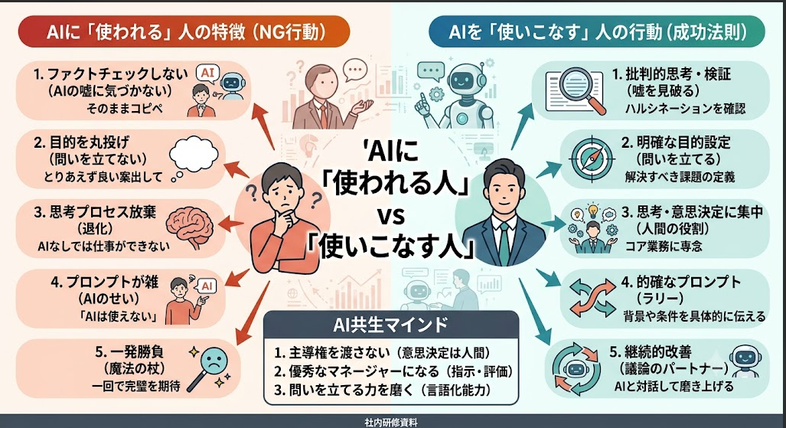

# AIに係るコンプライアンス

状況: 構成作成中

# メモ

[「阿部慎之助事件」の本当の原因はAIではない…「道具に使われる人」と「道具を使う人」の決定的な差](https://www.msn.com/ja-jp/news/national/%E9%98%BF%E9%83%A8%E6%85%8E%E4%B9%8B%E5%8A%A9%E4%BA%8B%E4%BB%B6-%E3%81%AE%E6%9C%AC%E5%BD%93%E3%81%AE%E5%8E%9F%E5%9B%A0%E3%81%AFai%E3%81%A7%E3%81%AF%E3%81%AA%E3%81%84-%E9%81%93%E5%85%B7%E3%81%AB%E4%BD%BF%E3%82%8F%E3%82%8C%E3%82%8B%E4%BA%BA-%E3%81%A8-%E9%81%93%E5%85%B7%E3%82%92%E4%BD%BF%E3%81%86%E4%BA%BA-%E3%81%AE%E6%B1%BA%E5%AE%9A%E7%9A%84%E3%81%AA%E5%B7%AE/ar-AA24Ma5z?ocid=msedgntp&pc=U531&cvid=6a2231d57d2d4db885afe3728c16dfe1&ei=8)

@All
再三言っていることだと思うのですが、再度共有で

今研修等もしているかと思うのですけど、お客様の問い合わせとかでそのままＡＩで打ち返したりして、混乱を招くことも可能性としてはあり得るなと思いまして

## 事例1：【ネットの嘘に騙されるリスク】

### クマ出没の「AIフェイク画像」を本物と信じ、自治体が大混乱

2025年11月末、宮城県女川町の公式SNSが「市街地にクマが出没した」と衝撃的な写真付きで注意喚起を行いました。しかし、これは後に**生成AIで作られたフェイク画像**だと判明し、町が謝罪する事態になりました。

- **事件の背景：** 作成者は「同僚を騙そうとするいたずら」でAI画像を作り、それを本物と勘違いした別の人が善意で町に通報。町は住民の安全を優先して急いで発信したため、確認が漏れてしまいました。結果、小中学校の集団下校や部活動中止など、地域全体が大混乱に陥りました。
- **従業員への落とし込み方：**
    
    > 「ネットや取引先から送られてきた『衝撃的な画像や情報』を、裏取りせずにそのまま信じて社内共有したり、業務の判断材料にしたりしていませんか？ 今やAIを使えば1分で本物そっくりの嘘データを作れます。『送られてきたから本物だろう』という思い込みは、業務を大混乱させるリスクがあります」
    > 

https://www.itmedia.co.jp/aiplus/article/2511/26/1251126123/

## 事例2：【公式発信で会社の信用を失うリスク】

### JALや老舗菓子メーカーの「不自然なAI画像」による炎上

2025年後半から2026年にかけて、企業の公式発信で安易にAI画像を使ったことによる炎上が相次いでいます。日本航空（JAL）では、最高級クレジットカードの特設サイトで、ポップコーンにストローが刺さっていたり、人間の脚だけが不自然に写っていたりする「違和感だらけのAI画像」を掲載してしまい、品質チェックの甘さを批判され取り下げに追い込まれました。また、老舗の神戸風月堂でも、SNSの投稿に実物ではないAI画像を使ったことで「嘘の投稿（やらせ）ではないか」と疑われ、謝罪する騒ぎになりました。

- **事件の背景：** どちらも悪意はなく、プロモーションの効率化やイメージ重視でAI画像を採用したものの、人間の目による最終チェック（クオリティコントロール）が不十分だったことが原因です。
- **従業員への落とし込み方：**
    
    > 「社内報、チラシ、公式SNS、お客様への提案書などで『無料だから』『便利だから』と安易にAI画像を使っていませんか？ 不自然な画像はユーザーに一瞬で見抜かれ、『手抜きをしている』『適当な仕事をする会社だ』と、会社のブランドを傷つける結果になります」
    > 

https://www.itmedia.co.jp/aiplus/article/2508/04/1250804064/

## 事例3：【無自覚な情報漏洩リスク】

### 「シャドーAI（会社に内緒でのAI利用）」による機密・顧客データの流出

2026年現在、多くの企業で問題視されているのが、社員が会社の許可を得ていない個人のChatGPTやAIツールに、業務データを入力してしまう「シャドーAI」です。「長文の議事録の要約が面倒だから」「プログラムのエラーを早く直したいから」という**業務効率化の善意**が裏目に出るケースが多発しています。

- **事件の背景：** 2026年のセキュリティ企業の調査でも、AIツールへの入力データの約4割に機密情報が含まれていたと報告されています。また、退職した社員の個人AIアカウントに、過去の顧客データや社外秘の企画書がそのまま残ってしまうガバナンス違反も表面化しています。
- **従業員への落とし込み方：**
    
    > 「『ちょっと文章を直してもらうだけだから』と、会社のルールで禁止されているAIに、会議のメモやお客様の名前、自社の開発コードを貼り付けていませんか？ その瞬間、データは外部のサーバーに送信され、AIの『学習データ』として世界中に再利用されるリスクがあります。一度入力したデータは、二度と回収できません」
    > 
- **参考データ・詳細：** [クラウドネイティブ ブログ「シャドーAIとは？最新調査と対策【2026年5月】」](https://blog.cloudnative.co.jp/articles/shadow-ai-zero-trust-countermeasures-2026/)

打ち合わせメモ

チャッッピー
ジェミニ
クロード
アンチグラビティ

会社名義

【活用しているところ】

SMART GOLFに落とし込むと。。。
・外部の人に連絡する時に、メールする時に
**人の目で見て確認する（ノーチェックで送付しない）**

CS
　AI→レビューで配信
お客様窓口はAI

【AIでやって欲しくないこと】
・会社情報を書き込むこと　：事例3
とくに個人のアカウントで
・100％信用しない、目でチェックする：事例1、2
信用して良くない選択をしてしまう

【道具に使われる人、道具を使う人】
のめいかくな違いを伝えたい
『意識を持って欲しい』
・脳死でやるのはだめ、考えることをやめないでほしい
・感情的に使わない
・人間じゃないんだよ

**エージェント機能を持つAIツールほど厳格な統制が必要になってきています。**

**【AIを正しく使いこなせるようにしましょう】**

台本→6/18(金)

# 構成要素たたき

- 問題提起
    - AIの使い方、向き合い方を誤ると取り返しのつかない事件につながる（阿部監督の事例）
    - 道具に使われない、道具を使える人になってほしい
- 各部署のAI活用例
    - カスタマーサポートLINEの自動応答：CS部
    - 返答内容の検討、構成作成：CS部
    - ロープレの評価：営業部
    - 企画の叩き台作成：マーケティング部
    - 議事録の自動化：マーケティング部
    - 画像生成、動画生成によるイメージ作成：SNS運用部
        - 活用しているAIツール
            - chatGPT
            - GEMINI
            - CLAUDE
- 個人情報漏洩の禁止
- AIによるニュース事例
    - ①【公式発信で会社の信用を失うリスク】
        - **従業員への落とし込み方：**
            
            > 「社内報、チラシ、公式SNS、お客様への提案書などで『無料だから』『便利だから』と安易にAI画像を使っていませんか？ 不自然な画像はユーザーに一瞬で見抜かれ、『手抜きをしている』『適当な仕事をする会社だ』と、会社のブランドを傷つける結果になります」
            > 
        - ハルシネーション
        - そのままＡＩで打ち返したりして、混乱を招くことも可能性
            - メールの返信、お客様への返答、
    - ②【ネットの嘘に騙されるリスク】
        - **従業員への落とし込み方：**
            
            > 「ネットや取引先から送られてきた『衝撃的な画像や情報』を、裏取りせずにそのまま信じて社内共有したり、業務の判断材料にしたりしていませんか？ 今やAIを使えば1分で本物そっくりの嘘データを作れます。『送られてきたから本物だろう』という思い込みは、業務を大混乱させるリスクがあります」
            > 
    - ③【無自覚な情報漏洩リスク】
        - **従業員への落とし込み方：**
            
            > 「『ちょっと文章を直してもらうだけだから』と、会社のルールで禁止されているAIに、会議のメモやお客様の名前、自社の開発コードを貼り付けていませんか？ その瞬間、データは外部のサーバーに送信され、AIの『学習データ』として世界中に再利用されるリスクがあります。一度入力したデータは、二度と回収できません」
            > 
    - エージェント機能を持つAIは特に制御が難しい
- AIを使いこなすためのマインド
    - AIはあくまでも道具、何も考えずに使うと、道具に使われることになる
    - 便利だからといって、考えることはやめないでほしい
    - 感情的に使うことで、冷静な判断ができなくなる（言いなりになってしまうリスク）
    

# 構成

SMART GOLF　AI時代に適合できない道具人間にならないために

### **問題提起**

- AIが普及したことによる懸念や事案
- AIに「使われる人間」と「使いこなす人間」がいる

### **AIに使われることで生まれるリスク**

**①ネットの嘘に騙されるリスク**
　◎事例
　　ネットの画像を信じて注意喚起した結果、フェイク画像だった
　◎提言
　　真偽不明な情報は信用しないこと、必ず裏取りをすること

**②無自覚な情報漏洩のリスク**
　◎事例
　　個人で利用しているAIに業務データを入力してしまうケースが多い（シャドーAI）
　◎提言
　　業務効率化のために活用するのは良いことだが、AIの学習データとして世界中で再利用されるリスクがある
　　「一度入力したデータは2度と回収できない」ことを肝に銘じること

**③公式発信で会社の信頼を失うリスク**
　◎事例
　　画像生成を用いた広告で、現実ではあり得ない破綻している状態の画像を用いた事で批判、手抜きとも取れる品質管理、適当な仕事をする会社としてブランドのイメージダウン
　◎提言
　　不自然な画像はもちろん、文章においても、不自然さは一瞬で見抜かれるので、必ず人の目で最終チェックを行うことが人間の最低限の役目

### AIを使いこなす人間になるために

- AIは魔法の杖ではありません、あくまでも強力な道具でしかない
- 考えることをやめた時点で、あなたはAIの部下になってしまう
- AIの答えを正しく見極め、責任を持つのはあなた自身
- 正しく向き合いAIを最高のバディとして使いこなしていきましょう

# 動画詳細

## SMART GOLF コンプライアンス研修 #2　-AIとの向き合い方-

# ①オープニング・問題提起

## 映像イメージ

AIロゴ＋活用事例をテキストで背景に並べる

## ナレーション

議事録の作成から、返信の添削、営業のフィードバックなど

SMART GOLFでも業務に欠かせない存在となっているAI

とても便利なツールですが、あなたは正しく使うことができていますか？

AIの爆発的な進化に伴い社会問題ともなっているのが、「AIに使われる人間の増加」です

この動画では、AIを正しく使いこなす優秀なビジネスパーソンになっていただくために

- AI時代が引き起こす人的トラブル
- 「AIを使いこなす人」に必要なこと

をお伝えしていきます

# ②AI時代が引き起こす人的トラブル

## 映像イメージ

🔽事例①

🔽店舗の水漏れを生成（御嶽山は本物、日吉は生成）

🔽事例②

PCで仕事をする男性の画像

🔽事例③

## ナレーション

AIを正しく使うことができず、トラブルにまで発展するケースは非常に多く

その中でも特に話題となった事例を3つ紹介いたします

### **①ネットの嘘に騙されるリスク**

こちらは、熊出没の注意喚起とともに女川町がSNSに投稿した画像です

よく見ると影の形に違和感があり、生成画像ということがわかります

通報を受けた女川町が町民の安全を優先し、裏取なく発信したことで地域住民を混乱させるトラブルとなりました

生成AIの精度は日々上がってきています（ディープフェイク）

衝撃的な情報であればあるほど、**必ずその裏取りをすることが重要となってきます**

### **②無自覚な情報漏洩のリスク**

AIによる業務効率の改善を進める企業が増えていく中で

個人で利用しているAIに業務データを入力してしまう、いわゆるシャドーAIが問題となっています

入力してしまった業務データは、AIのサーバーに保存され

AIの学習データとして世界中で再利用されるリスクがあります

一度入力したデータは回収することができません

**会社で許可されているAI以外では、業務データを入力しないでください**

### **③公式発信で会社の信頼を失うリスク**

こちらは、JALの広告で実際に使用された画像です

よくみると不自然な状態になっていることがわかります

手抜きとも取れる品質管理に対し批判を集め、

適当な仕事をする会社として、ブランドのイメージダウンに繋がりました

AIが出力したものには、不自然さがあります

必ず人の目で最終チェックを行うことが、AIとの共生には欠かせません

# ③「AIを使いこなす人」に必要なこと

## 映像イメージ

## ナレーション

AIに使われる人と使いこなす人の決定的な違いは、**「自分で考えて判断しているか」**です

AIの回答が本当に適切か、自分や周囲にどのような影響をもたらすか

それを自分でしっかり考えた上で判断をしなくてはいけません

考えることをやめた時点で、あなたは「AIに使われる人」になってしまいます

AIはこれからも進化し、より強力なツールとなってきます

正しく向き合い「自分の考えを洗練させるツール」としてAIを使いこなし

優秀なビジネスパーソンへと成長していきましょう