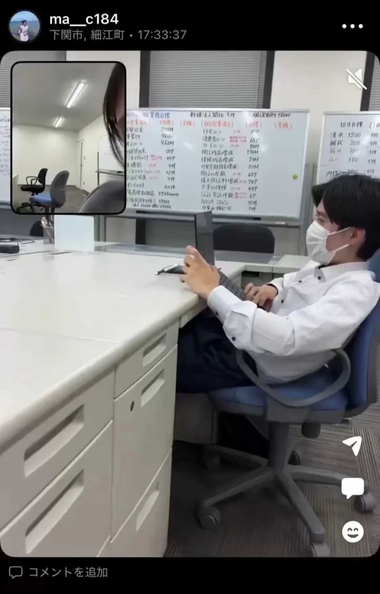

# SMART GOLF 基本遵守事項

URL: https://youtu.be/Be_DuwmTUl8
概要: 情報漏洩の重要性、SNSの注意点、SMART GOLFにおける個人情報の例
状況: 作成済み

# 構成

SMART GOLF　基本遵守事項コンテンツ

- 問題提起
    - 西日本シティ銀行の事例を出す
- 個人SNSの使い方留意点
- 個人スマホの使い方
    - 業務内容スクショ画像の即削除
    - 社内資料の個人デバイスへの保存禁止
- 個人情報漏洩の禁止
    - STORESの顧客情報
    - リニーの顧客情報
    - FCオーナー情報
    - 防犯カメラ映像

# 動画詳細

## SMART GOLF 基本遵守事項 -情報漏洩の危険性-

# ①オープニング・問題提起

## 映像イメージ

SNS見てる風な映像で始まる

ノイズでシーンを切り替え
頭取の謝罪映像に切り替わる

## ナレーション

たった一つの投稿が、会社を揺るがす大きな事件に繋がることがあります

これは2026年4月、西日本シティ銀行で発生した事例です

とある行員が仕事の様子を撮影し、SNSに投稿

投稿された画像や動画には「顧客名」や「目標数値」など、数多くの情報があり

その投稿は一気に拡散、不特定多数の人に届くこととなりました

個人情報を漏洩させたことで社会的信用は失墜し、厳しい法的責任や処分が下されました。

SNSは個人の自由な場だと思われがちですが、仕事の情報を一度でも流せば、それは取り返しのつかない『情報漏洩事件』となります

この動画では、皆さんに守ってほしいSNS利用についてと、個人情報のルールを再確認していきます

# ②個人SNSが持つリスクの考え方

## 映像イメージ

『SNSのリスク』『リスクに対する捉え方』

## ナレーション

プライベートのSNSで、パソコンの画面やオフィス内の風景を投稿していませんか？

「モザイクしてるから大丈夫」

「友人だけしか繋がってないから大丈夫」

「24時間で消えるから大丈夫」

この気持ちに少しでも共感できてしまったら、直ちに考えを改めてください

映り込んでないと思い込んでいるだけの可能性

友人の関係者が見ている、またはがアカウントが乗っ取られて全く知らない人が見ている可能性

など、さまざまな可能性が存在しています

みなさんに考えてほしいのは『可能性の低さ』ではなく、『可能性があるか』です

どんなに小さな可能性でも、それ自体が信頼失墜の火種となりえます

# ③個人のスマホやパソコン上ルール

## 映像イメージ

## ナレーション

個人のスマートフォンやパソコンの使い方について、次のことを徹底してください

### **①業務内容のスクリーンショットの即削除**

連絡のためにスマートフォンの画面をキャプチャすることも多いと思います

用件が済んだらその瞬間に削除してください

カメラロールに残っていること自体がリスクとなります

### **②個人デバイスへの社内資料の保存禁止**

『家でも仕事がしたいから』『便利だから』などの理由で

会社の資料を個人のスマホやパソコン、またはクラウドに保存することは禁止です

必ず業務用のパソコンで管理することを徹底してください（個人のUSBメモリも禁止）

# ④SMART GOLFが持つ「個人情報」

## 映像イメージ

①
実際の画面をぼかし入れて

②
居酒屋で会話している写真

③
防犯カメラ本体の写真

## ナレーション

では実際に、SMART GOLFが持つ個人情報には、どのようなものがあるのか確認をしていきます

### **①STORES・リニーの顧客情報**

主に会員様の「お名前」「電話番号」「購入履歴」などを閲覧することが可能です

これらはすべて、お客様からお預かりしている大切な個人情報です

### **②取引先様の情報**

FCオーナー様や広告代理店、システム管理会社など、取引先情報も重要な機密事項です

公共の場で特定できるような人名や社名を出しての会話は控えましょう

### **③防犯カメラの映像**

「誰がいつどこにいたか」という映像も立派な個人情報です

興味本位でスマホで撮影したり、外部に共有することは厳禁です

これらの個人情報以外にも、チャットのやりとりやメールなど

社内のコミュニケーションについても機密事項です

# ④エンディング

## 映像イメージ

## ナレーション

『これくらい大丈夫だろう』という甘い考えが、あなた自身と、共に働く仲間、そして会社の未来を壊します

一人前の社会人として、情報の重みを理解し、正しい行動を選択しましょう

ご視聴ありがとうございました